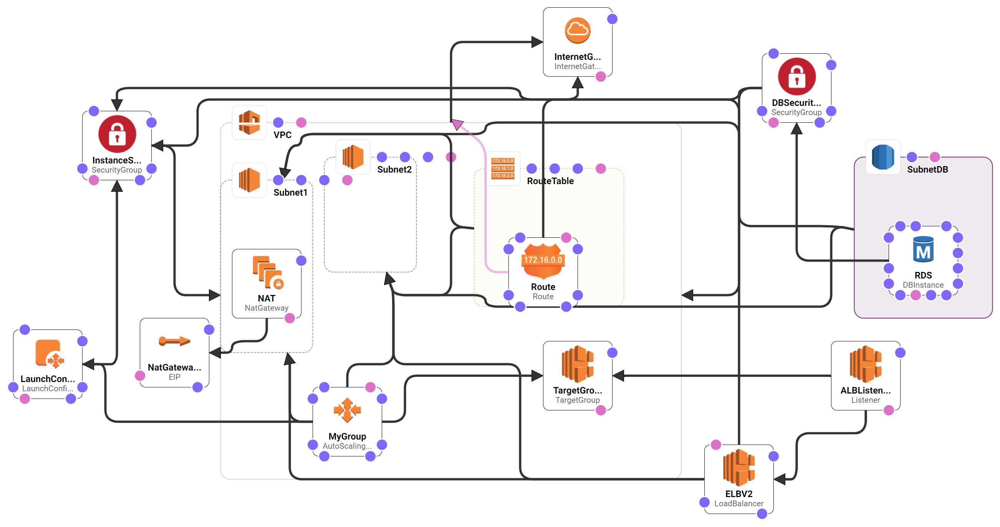

# CloudFormation WordPress

## The project

As stated in the general project description, the main goal is to automate the deployment of a customizable WordPress in HA in an AWS environment. For this purpose, it is recommended to follow the architecture-as-code principles; therefore, a templating technology stack such as AWS CloudFormation or Terraform.
The proposed code is intended to create all the AWS components to deploy *n* instances of the  *Bitnami WordPress stack* installed on the top of an AWS Load Balancer and an RDS MySQL-like database.

This template is supposed to be parameterized with, al least, the following parameters:

* The name of the blog.
* The username of the WordPress administrator.
* The email address of the WordPress user.
* Login and password.
* The number of nodes.

## The proposal

An AWS CloudFormation template has been developed with three main components, namely:  WordPress EC2 instance, AWS Load Balancer and a MySQL-like RDS database.
Specifically, some details are highlighted:

* **Base AMI**:
The first step is the creation of a generic Linux instance (in this case Ubuntu 18.04) in which the Bitnami WordPress installer has been downloaded and installed.

* **Configuration script**:
Using the user-data field in the CloudFormation template, a script has been developed for modifying the default DB connection (the internal database provided out-of-the-box in the Bitnami stack) to an external RDB database.
Note this script also takes into account the scaling-up process: the first time it is required to dump the data from the internal database and export them to the RDS. Otherwise, this migration should not be triggered.

* **Security Group**:
These components are responsible for controlling the inbound and outbound traffic within instances and other AWS resources.

* **AWS Load Balancer** :
This component is supposed to automatically balance the traffic in a certain auto-scaling group of EC2 instances. Note that two different networks in different availability zones are required.

The diagram depicts a general overview of the proposed solution. This figure also includes every low-level component required for this solution to work.



## How to use the template

The parameters of the CloudFormation are:

* `myKeyPair`: when you launch an instance, you specify the key pair. You can specify an existing key pair or a new key pair that you create at launch. It is very important to have the file well saved because if it is lost, the instance can no longer be accessed.
* `BlogUser`: Admin user of WordPress  
* `BlogPassword:` Password of the login of WordPress
* `BlogEmail`: Email for admin of WordPress
* `BlogName`: The name of the WordPress
* `NumberOfNodes`: The minimum of the nodes to be deployed

Steps to deploy using the AWS CLI:

* *Prerequisite*: install the AWS CLI in your system following [the official steps.](https://docs.aws.amazon.com/cli/latest/userguide/cli-chap-install.html)
* Download the [CloudFormation template](wordpress-bitnami.yaml).
* Execute in your command line the following command:

```bash
aws cloudformation create-stack --stack-name <NAME_OF_STACK> \
--template-body wordpress-bitnami.yaml --parameters \
ParameterKey=myKeyPair,ParameterValue=<KEY_NAME>  \
ParameterKey=BlogUser,ParameterValue=<VALUE_USER> \
ParameterKey=MasterUserPassword,ParameterValue=<VALUE_PASSWORD> \
ParameterKey=BlogEmail,ParameterValue=<VALUE_EMAIL> \
ParameterKey=BlogName,ParameterValue=<VALUE_BLOG_NAME>  \
ParameterKey=NumberOfNodes,ParameterValue=<VALUE_NUM_NODE>\

```

Example:

```bash
aws cloudformation create-stack --stack-name mystack-cli --template-body wordpress-bitnami.yaml --parameters ParameterKey=myKeyPair,ParameterValue=key ParameterKey=BlogUser,ParameterValue=user ParameterKey=BlogPassword,ParameterValue=123456789 ParameterKey=MasterUserPassword,ParameterValue=123456789  ParameterKey=BlogEmail,ParameterValue=user@user.es ParameterKey=BlogName,ParameterValue=MyBitnamiBlog ParameterKey=NumberOfNodes,ParameterValue=1
```

## Limitations of the solution

There is still future work so that it can be considered a finished product.

* [L1] No distributed file system is being used.  As a consequence, the instances will not share files, as they are independent instances with their own EBS storage even though they do access the same database. Issues regarding plugins and themes are expected.

* [L2] This solution is only valid in certain availability zones, specifically, `us-west-2`.

* [L3.1] Currently, the EC2 instance type is not parametrized, specifically, the default value is `t3.medium`.

* [L3.2] Currently, the RDS instance type is not parametrized, specifically, the default value is `db.t2.micro` with `100 GB`.

* [L4] The template is not ready to work with SSL certificates.

## Enhancements

* [E1] The lack of a shared storage is an actual problem that hinders the installation of themes, plugins and file submission. A straightforward approach would be the usage of a Network File System (NFS), allowing concurrent reading and writing amongst instances. Specifically, in the AWS scenario, a possible solution would *Elastic File System* (EFS). This enhancement would solve [L1].

* [E2] The current solution is only valid for one availability zone (AZ). In order to support any AZ, it would be necessary i) to create or clone the AMI for the chosen AZ and ii) add modify the AZ value on the template, precisely in the network section (it can be also parametrized). This enhancement would solve [L2].

* [E3] In order to increase the flexibility regarding the type of instances and size, the values of `InstanceType` and `DBInstanceClass` can be parametrized by means of a map of the compatible types. A similar approach is applicable to the `AllocatedStorage`. This enhancement would solve [L3.1, L3.2].

* [E4] Supposing we already have an SSL certificate, the start script should be modified to add the configuration of the Apache server with it. Otherwise, a new certificate should be issued using, for example,  Let's Encrypt. Note that a task should be added in the Cron to periodically renew the certificate. This enhancement would solve [L4].

* [E5] In order to increase the flexibility and performance of the RDS, instead of a single instance of the database, a cluster of RDS can be used.

* [E6] It would be interesting to have a logging system so that we can know how the system behaves. CloudWatch logs could be properly configured to this end.

* [E7] Since the AMI is pre-configured to use a specific version of WordPress, a possible improvement would be the usage of a generic Linux instance and then manually install WordPress using the start script.

## Keeping this solution up-to-date

Currently, in order to keep this solution always updated, it would be necessary to create a new script for creating a new AMI with the latest version of WordPress Bitnami. Next, update the CloudFormation template so that it uses the new AMI.
Note that, in the case of starting from a multiple AZs, a new AMI is required for each availability zone.

Another approach is to simply use a generic Linux instance as the AMI and then modify the start script so that it downloads the chosen WordPress version.
